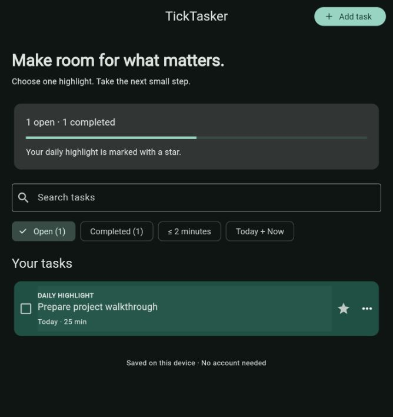

# TickTasker

**Finish one meaningful thing at a time.**

A focused Flutter task manager by [Hareth Al-Fawaz](https://github.com/The7areth). Capture tasks, choose a daily highlight, and find a small next step without an account or a backend.

[](https://github.com/The7areth/TickTasker/actions/workflows/checks.yml)



## What you can do

- **Capture and edit tasks** with a title, optional time estimate, and commitment level: Idea → Maybe → Today → Now.
- **Choose one daily highlight.** Pin, unpin, and complete it from the task list. The highlight expires on the next local calendar day; the task remains.
- **Find the next small step** with search, a two-minute filter, and a Today + Now filter.
- **Track progress** through separate open and completed views. Reopen completed tasks or delete them after confirmation.
- **Reuse tasks** with Duplicate in the task menu. Adjust the draft and save a fresh, incomplete copy.
- **Recover a deletion** with Undo in the confirmation message, or reset an empty search with Clear filters.
- **Keep tasks between sessions** using local storage. Failed saves preserve the previous state and present a retryable error.
- **Use light or dark mode** based on the device setting, with a responsive layout for phone and desktop widths.

## Run locally

Validated toolchain: **Flutter 3.38.3 / Dart 3.10.1**. The package requires Dart 3.9.2 or newer.

```sh
git clone https://github.com/The7areth/TickTasker.git
cd TickTasker
flutter pub get
flutter run -d chrome
```

For Android or iOS, start an emulator/simulator or connect a device, then use `flutter devices` and `flutter run -d <device-id>`. Android requires the Android SDK; iOS requires macOS and Xcode. Mobile store distribution also requires platform signing configuration.

```sh
flutter analyze
flutter test
flutter build web
```

The web build is written to `build/web`. Serve that directory through an HTTP server. For subdirectory hosting, provide the corresponding `--base-href` when building.

## Design

```text
lib/
  main.dart                    App theme, startup, load/retry states
  models/task.dart             Immutable task and input invariants
  data/task_store.dart         Local storage adapter
  data/task_repo.dart          Serialized writes, task operations, filters
  features/today/
    today_page.dart            Task workspace and daily highlight
    task_editor.dart           Validated add/edit form
test/
  task_repo_test.dart           Persistence and state transitions
  widget_test.dart              Interactive workflows and layout checks
```

The UI observes a `ChangeNotifier` repository. A storage interface makes persistence replaceable and allows deterministic tests. Each mutation produces a new task list, writes a versioned JSON snapshot, then publishes the updated state. Writes are serialized so rapid actions do not overwrite one another.

[Architecture and tradeoffs](docs/architecture.md) · [Application walkthrough](docs/walkthrough.md) · [Verification](docs/verification.md)

## Project scope

This release implements the task workflow. Habit streaks, the Two-Day Rule, the Study → Write pipeline, reminders, and cross-device sync are future extensions. The earlier experimental branches remain available in Git history.

Tasks are stored on the current device or browser profile through `shared_preferences`. This is a lightweight personal task store; browser data clearing or uninstalling the application can remove saved tasks. The next persistence milestones are export/import and a database-backed repository for larger datasets. Cloud accounts and multi-device synchronization would require a separate backend.
